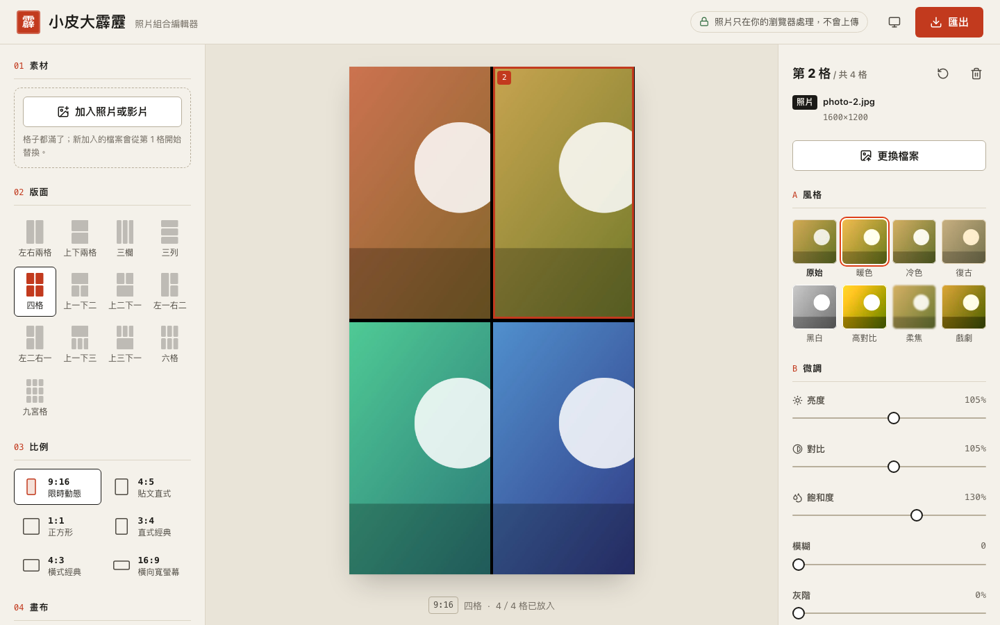

# 小皮大霹靂｜照片組合編輯器

把多張照片、影片或 GIF 排成 IG 限時動態、貼文用的組合圖，匯出 PNG、GIF 或 MP4。
**所有處理都在使用者的瀏覽器完成，照片不會上傳**，也不需要登入。

線上版：<https://whalechao.github.io/happybigbomb/>



## 功能

- 13 種版面（兩格到九宮格、上一下三等混合排法）、6 種比例（9:16、4:5、1:1、3:4、4:3、16:9）
- 每格可放照片、影片或 GIF；可一次選多個檔案依序填入，也能直接拖曳到格子
- 每格獨立調整：8 種風格預設、亮度／對比／飽和度／模糊／灰階／懷舊色調、填滿或完整顯示、縮放與位置
- 操作：拖曳移動、雙指或觸控板捏合縮放；鍵盤可用方向鍵移動、＋／− 縮放、Enter 選檔、Delete 移除
- 匯出：PNG（1920／2560／3840 長邊）、循環 GIF（長邊 720）、MP4（H.264，最長 15 秒，無聲）
- 淺色／深色主題（預設跟隨系統），支援「減少動態效果」設定

## 開發

需要 Node.js 20.19 以上（CI 使用 22）。

```bash
npm ci            # 安裝相依套件
npm run dev       # 開發伺服器 http://localhost:5173/happybigbomb/
npm run lint      # ESLint（不允許任何警告）
npm test          # Vitest 單元測試
npm run build     # 型別檢查 + 建置到 dist/
npm run check:static   # 確認 dist/ 沒有引用任何外部網址
npm run test:e2e  # Playwright 冒煙測試（需先 build；首次執行前跑 npx playwright install chromium）
```

`npm run test:e2e` 會在 390、768、1440 三種寬度、淺色與深色下截圖到 `docs/screenshots/`，並檢查：
沒有整頁橫向捲動、觸控點擊區 ≥ 40px、輸入元件字級 ≥ 16px、沒有連到外部網址，以及 PNG／GIF／MP4 匯出、鍵盤操作、錯誤訊息、記憶體釋放與 iframe 嵌入。
本機想完整測 MP4 匯出可用 `PW_CHANNEL=chrome npm run test:e2e`（Playwright 內建的 Chromium 沒有 H.264 編碼器，會改為驗證「不支援時改選 GIF 並說明原因」）。

### 專案結構

```
src/
  App.tsx                     狀態與版面骨架
  components/
    AssetManager.tsx          一次加入多個檔案（點選／拖曳）
    CanvasEngine.tsx          預覽畫布：量測、拖曳／捏合縮放、鍵盤操作
    EffectEditor.tsx          單格調整面板
    ComposePanel.tsx          版面、比例、畫布設定
    ExportDialog.tsx          匯出視窗（進度、取消、結果）
  services/ExportService.ts   PNG／GIF／MP4 合成與編碼
  lib/                        幾何、濾鏡、GIF 解碼、檔案讀取、嵌入等純函式
e2e/                          Playwright 測試
config/base.ts                VITE_BASE 解析
```

預覽與匯出共用同一套幾何函式（`lib/geometry.ts`），間距、圓角、模糊以「畫布短邊 / 360」為單位儲存，
所以成品與預覽一致，且輸出解析度與螢幕大小無關。

## 部署

推送到 `main` 後，`.github/workflows/deploy.yml` 會執行 lint、測試、建置並發布到 GitHub Pages（設定為 *GitHub Actions* 來源）。
`ci.yml` 會在每個 Pull Request 跑 lint、單元測試、建置、靜態檢查與 Playwright 冒煙測試。

### 本機維護腳本（Windows／macOS 雙版本）

| 用途 | Windows | macOS |
| --- | --- | --- |
| 安裝相依套件（`npm ci`） | `tools\windows\npm_install.bat` | `tools/mac/npm_install.sh` |
| 完整檢查（lint、測試、建置） | `tools\windows\check_build.bat` | `tools/mac/check_build.sh` |
| 只建置，輸出存到 `build_output.txt` | `tools\windows\test_build.bat` | `tools/mac/test_build.sh` |
| 本機檢查通過後提交並推送到 `main` | `tools\windows\push_updates.bat [說明]` | `tools/mac/push_updates.sh [說明]` |
| 同上（Python 版，兩邊通用） | `python tools\auto_deploy.py "說明"` | `python3 tools/auto_deploy.py "說明"` |

腳本以自己所在位置找專案根目錄，不寫死磁碟路徑（例如 `K:\happybigbomb`）。
推送後由 GitHub Actions 自動部署，所以不再使用舊的 `npm run deploy`（`gh-pages` 套件）。

## 嵌入到其他網站

建置產物是純靜態檔案：不呼叫外部 API、不需要登入、不使用 CDN，字型用系統字型、圖示打包在 JS 內。
建置時會在 `index.html` 加上 Content-Security-Policy，只允許載入同網域的檔案。

### 1. 設定路徑並建置

`base` 由環境變數 `VITE_BASE` 決定，未設定時為 `/happybigbomb/`（GitHub Pages）。

```bash
# 放在宿主網站的 /tools/collage/ 底下
VITE_BASE=/tools/collage/ npm run build

# 不確定最終路徑時，用相對路徑（可放在任何子目錄）
VITE_BASE=./ npm run build
```

輸出目錄是 `dist/`，把整個資料夾內容複製到對應路徑即可（包含 `index.html`、`assets/`、圖示與 `manifest.json`）。

### 2. 用 iframe 嵌入

```html
<iframe
  id="happybigbomb"
  src="/tools/collage/?embed=1&parentOrigin=https://你的網域"
  title="照片組合編輯器"
  style="width:100%;border:0"
  allow="web-share"
  sandbox="allow-scripts allow-same-origin allow-downloads allow-popups"
></iframe>
<script>
  // 依內容自動調整 iframe 高度
  window.addEventListener('message', (e) => {
    if (e.data && e.data.type === 'happybigbomb:height') {
      document.getElementById('happybigbomb').style.height = e.data.height + 'px';
    }
  });
</script>
```

網址參數：

| 參數 | 說明 |
| --- | --- |
| `embed=1` | 強制使用嵌入版面（在 iframe 內會自動開啟；`embed=0` 可關閉） |
| `parentOrigin=https://…` | 高度訊息只送給這個來源；未指定時用 `*`（訊息只有高度數字，不含使用者資料）。也可在建置時用 `VITE_EMBED_PARENT_ORIGIN` 設定 |
| `theme=light` / `theme=dark` | 指定配色以配合宿主頁面；未指定時跟隨系統 |

嵌入模式的差異：版面高度由內容決定（不依賴 iframe 的視窗高度，避免回報高度時互相影響）、不註冊 Service Worker、不顯示「清除離線快取」。
若 iframe 有 `sandbox`，需包含 `allow-downloads` 才能下載匯出檔；手機上的「分享／儲存到相簿」需要 `allow="web-share"`。

## 已知限制

- MP4 需要瀏覽器支援 WebCodecs 的 H.264 編碼（新版 Chrome、Edge、Safari 可以；部分 Firefox／Linux Chromium 不行，會提示改用 GIF）。輸出無聲。
- 不支援 `ctx.filter` 的瀏覽器（舊版 Safari）匯出時用逐像素方式套用濾鏡，「模糊」無法套用，會在匯出結果中提示。
- HEIC 照片只有 Safari 能直接讀取，其他瀏覽器會說明如何改用 JPG。
- 動態匯出長度上限 15 秒；GIF 為 256 色。
